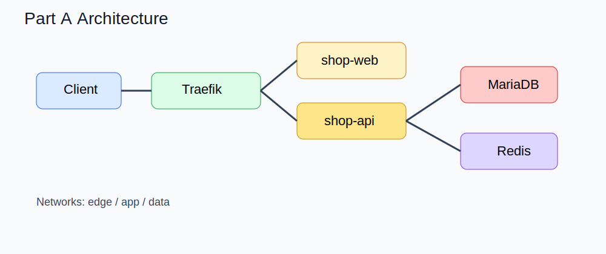

# Workbook A — Docker Stack 실무형 기본기



## 1. 목표

이 실습의 핵심은 **Docker Stack 으로 이커머스 서비스를 배포하고, 배포 후 운영자가 수행하는 기본 제어 루틴을 익히는 것**입니다.

### 학습 목표

- manager 노드에서 `docker stack deploy` 로 스택 배포
- Traefik 기반 ingress 동작 확인
- `shop-web`, `shop-api`, `MariaDB`, `Redis` 서비스 확인
- scale in/out 수행
- rolling update 수행
- 수동 rollback 수행
- `drain` / `active` 전환과 task 이동 확인
- Docker Config / Secret 교체 절차 이해

## 2. 공식 기준 요약

- `docker stack` 과 `docker service` 조작은 manager 에서 수행 [Docker Docs](https://docs.docker.com/engine/swarm/stack-deploy/)
- `docker stack deploy` 는 legacy Compose v3 계열 형식을 기준으로 구성 [Docker Docs](https://docs.docker.com/engine/swarm/stack-deploy/)
- scaling, rolling update, rollback, placement 제어는 Swarm service 운영의 핵심 [Docker Docs](https://docs.docker.com/engine/swarm/services/)
- `drain` 시 서비스 task 는 active 노드로 재배치 [Docker Docs](https://docs.docker.com/engine/swarm/swarm-tutorial/drain-node/)
- Traefik Swarm provider 라벨은 `deploy.labels` 에 두는 것이 중요 [Traefik Docs](https://doc.traefik.io/traefik/reference/install-configuration/providers/swarm/)

## 3. 사전 준비

### 3.1 노드 확인

```bash
docker node ls
```

기대 상태:

- `swarm-manager` = Ready / Active / Leader or Reachable
- `swarm-worker1` = Ready / Active
- `swarm-worker2` = Ready / Active

### 3.2 라벨링 예시

```bash
bash scripts/node-labeling.sh
```

혹은 직접:

```bash
docker node update --label-add zone=az1 swarm-worker1
docker node update --label-add zone=az2 swarm-worker2
docker node update --label-add db=true swarm-worker1
```

### 3.3 이미지 빌드/푸시

`.env.example` 를 참고해 레지스트리 주소를 정합니다.

```bash
bash scripts/build-images.sh
bash scripts/push-images.sh
```

## 4. 배포 파일 읽기

주 파일:

- `stack/base/stack-a.yml`
- `configs/traefik/traefik.yml`
- `configs/app/web-banner-v1.json`
- `configs/app/api-feature-flags-v1.json`

핵심 포인트:

- Traefik 는 manager 고정 배치
- web/api 는 replicated
- MariaDB 는 단일 replica
- Redis 는 단일 replica
- web/api 는 overlay network 로 연결
- API 는 config 와 secret 을 읽도록 설계

## 5. Part A 배포

```bash
docker stack deploy -c stack/base/stack-a.yml ecommerce-a
```

배포 확인:

```bash
docker stack services ecommerce-a
docker stack ps ecommerce-a
```

세부 확인:

```bash
docker service ls
docker service ps ecommerce-a_shop-web
docker service ps ecommerce-a_shop-api
```

## 6. 기능 검증

### 6.1 Traefik / web 진입 확인

```bash
curl http://MANAGER_HOST/
```

### 6.2 API 상태 확인

```bash
curl http://MANAGER_HOST/api/health
curl http://MANAGER_HOST/api/ready
curl http://MANAGER_HOST/api/products
```

### 6.3 배포된 replica 확인

`shop-web` 과 `shop-api` 가 여러 노드에 분산되었는지 `docker service ps` 로 확인합니다.

## 7. 운영 실습 1 — 스케일 인/아웃

### 7.1 web scale out

```bash
docker service scale ecommerce-a_shop-web=3
```

### 7.2 api scale out

```bash
docker service scale ecommerce-a_shop-api=4
```

### 7.3 확인

```bash
docker service ls
docker service ps ecommerce-a_shop-web
docker service ps ecommerce-a_shop-api
```

### 체크 포인트

- desired state 와 running state 가 일치하는가
- task 가 여러 worker 에 분산되는가
- 서비스 응답이 계속 유지되는가

## 8. 운영 실습 2 — Rolling Update

새 태그 이미지를 준비한 뒤 아래처럼 업데이트합니다.

```bash
docker service update \
  --image REGISTRY/shop-api:1.1.0 \
  --update-parallelism 1 \
  --update-delay 10s \
  ecommerce-a_shop-api
```

확인:

```bash
docker service ps ecommerce-a_shop-api
docker service logs -f ecommerce-a_shop-api
```

### 관찰 포인트

- 한 번에 1개 task 만 교체되는가
- 서비스 중단 없이 점진 업데이트 되는가
- 새 이미지가 정상 health 상태를 만족하는가

## 9. 운영 실습 3 — Rollback

의도적으로 잘못된 태그 또는 잘못된 환경값으로 업데이트한 뒤 즉시 되돌립니다.

```bash
docker service update --rollback ecommerce-a_shop-api
```

공식적으로 rollback 은 `docker service update --rollback` 으로 수행합니다 [Docker Docs](https://docs.docker.com/engine/swarm/services/).

## 10. 운영 실습 4 — Node Drain / Active

### 10.1 drain 전 상태 확인

```bash
docker service ps ecommerce-a_shop-web
docker service ps ecommerce-a_shop-api
```

### 10.2 worker1 drain

```bash
docker node update --availability drain swarm-worker1
```

### 10.3 재배치 확인

```bash
docker node inspect swarm-worker1 --pretty
docker service ps ecommerce-a_shop-web
docker service ps ecommerce-a_shop-api
```

### 10.4 복구

```bash
docker node update --availability active swarm-worker1
```

### 관찰 포인트

- worker1 의 task 가 active 노드로 이동했는가
- drain 은 standalone container 에 영향이 없고 swarm task 에만 적용되는가 [Docker Docs](https://docs.docker.com/engine/swarm/swarm-tutorial/drain-node/)

## 11. 운영 실습 5 — Placement 제약

예를 들어 DB 를 `db=true` 라벨 노드에만 두도록 설계할 수 있습니다.

```bash
docker node update --label-add db=true swarm-worker1
```

stack 파일의 placement constraint 를 확인하고, `docker stack deploy` 를 다시 수행해보세요.

### 관찰 포인트

- 조건 불일치 시 task 가 pending 될 수 있음
- placement constraint 는 hard rule, placement preference 는 best effort [Docker Docs](https://docs.docker.com/engine/swarm/services/)

## 12. 운영 실습 6 — Config 갱신

현재 web 배너는 `web-banner-v1.json` 을 사용합니다. 새 config 를 만들고 스택 재적용으로 반영합니다.

```bash
docker config create web-banner-v2 configs/app/web-banner-v2.json
```

stack 파일에서 새 config 이름을 참조하도록 바꾼 뒤 재배포합니다.

```bash
docker stack deploy -c stack/base/stack-a.yml ecommerce-a
```

### 확인

```bash
curl http://MANAGER_HOST/api/config
```

## 13. 운영 실습 7 — Secret 갱신

기본 secret 은 예제 값입니다. 새 값으로 재생성한 뒤 서비스가 새 secret 을 참조하게 바꿔봅니다.

```bash
docker secret create jwt_secret_v2 secrets-example/jwt_secret.txt
```

그 다음 stack 파일의 secret 참조를 새 이름으로 바꾸고 재배포합니다.

## 14. 실습 완료 체크리스트

- [ ] stack 배포 성공
- [ ] web/api 상태 확인 성공
- [ ] scale out / scale in 수행
- [ ] rolling update 수행
- [ ] rollback 수행
- [ ] node drain / active 확인
- [ ] config 교체 수행
- [ ] secret 교체 수행

## 15. 정리

```bash
docker stack rm ecommerce-a
```

필요하면 config/secret/volume 도 정리합니다.

## 16. 다음 단계

Part A를 끝냈다면 `docs/workbook-b.md` 로 넘어가 장애대응형 실습을 진행하세요.
