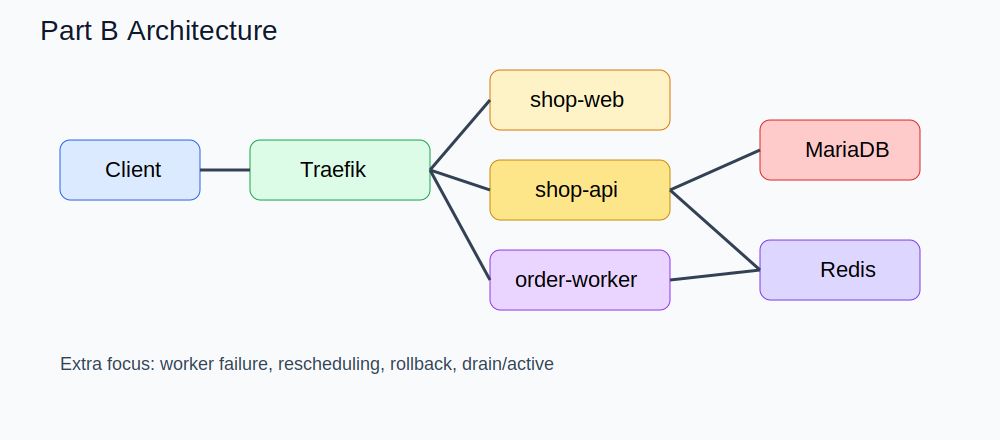

# Workbook B — 장애대응형 확장판



## 1. 목표

Part B는 Part A 위에 **worker, 장애 유도, 재배치, rollback, 운영 복구 절차**를 얹은 확장 실습입니다.

### 학습 목표

- `order-worker` 가 포함된 스택 배포
- 주문 생성 후 queue 기반 비동기 처리 확인
- worker 장애 유도 및 로그 확인
- 잘못된 업데이트 후 rollback
- node drain 시 worker 재스케줄링 확인
- 운영 점검 체크리스트 수행

## 2. 핵심 구성

- Traefik
- shop-web
- shop-api
- MariaDB
- Redis
- order-worker

worker 는 Redis 의 `orders` 큐를 소비해 주문 후처리를 수행합니다.

## 3. 배포

```bash
docker stack deploy -c stack/base/stack-b.yml ecommerce-b
```

확인:

```bash
docker stack services ecommerce-b
docker stack ps ecommerce-b
docker service ps ecommerce-b_order-worker
```

## 4. 기능 검증

### 4.1 주문 생성

```bash
curl -X POST http://MANAGER_HOST/api/orders \
  -H 'Content-Type: application/json' \
  -d '{"customer":"kim","items":[{"sku":"SKU-1001","qty":1}]}'
```

### 4.2 큐 상태 확인

```bash
curl http://MANAGER_HOST/api/admin/queue
```

### 4.3 worker 로그 확인

```bash
docker service logs -f ecommerce-b_order-worker
```

## 5. 장애 실습 1 — worker replica 축소

```bash
docker service scale ecommerce-b_order-worker=1
```

주문을 여러 건 넣고 backlog 가 쌓이는지 확인합니다.

```bash
curl http://MANAGER_HOST/api/admin/queue
```

## 6. 장애 실습 2 — worker 실패 유도

`FAIL_WORKER=true` 같은 잘못된 환경값을 적용하거나 fault injection override 를 사용합니다.

```bash
docker stack deploy \
  -c stack/base/stack-b.yml \
  -c stack/overrides/stack-fault-injection.override.yml \
  ecommerce-b
```

### 확인

```bash
docker service ps ecommerce-b_order-worker
docker service logs ecommerce-b_order-worker
```

### 관찰 포인트

- task 가 restart 되는가
- desired state 는 유지되지만 running 이 되지 않는가
- 로그에 명확한 오류가 남는가

## 7. 장애 실습 3 — Rollback

fault injection 을 제거하고 즉시 rollback 하거나 정상 stack 파일로 재배포합니다.

```bash
docker service update --rollback ecommerce-b_order-worker
```

또는

```bash
docker stack deploy -c stack/base/stack-b.yml ecommerce-b
```

## 8. 장애 실습 4 — node drain 과 재배치

worker 가 올라가 있는 노드를 확인한 뒤 해당 노드를 drain 합니다.

```bash
docker service ps ecommerce-b_order-worker
docker node update --availability drain swarm-worker2
```

확인:

```bash
docker node inspect swarm-worker2 --pretty
docker service ps ecommerce-b_order-worker
```

### 관찰 포인트

- worker task 가 다른 active 노드로 이동하는가
- 주문 처리가 계속 가능한가
- queue backlog 가 잠시 늘었다가 정상화되는가

## 9. 장애 실습 5 — 잘못된 이미지 업데이트

일부러 존재하지 않는 태그를 지정해봅니다.

```bash
docker service update --image REGISTRY/order-worker:broken ecommerce-b_order-worker
```

그 후 즉시 rollback 합니다.

```bash
docker service update --rollback ecommerce-b_order-worker
```

공식적으로 rolling update 와 rollback 제어는 `docker service update` 옵션으로 다룹니다 [Docker Docs](https://docs.docker.com/engine/swarm/services/).

## 10. 장애 실습 6 — placement 와 분산 배치 확인

worker 에 zone label spread 를 적용해 보고 task 분산을 관찰합니다. preference 는 best effort 이므로 완벽한 강제는 아니며, constraints 와 다르게 배치 실패를 강제하지 않습니다 [Docker Docs](https://docs.docker.com/engine/swarm/services/).

## 11. Config / Secret 운영 실습

### 11.1 feature flag 교체

`api-feature-flags-v1.json` 을 `v2` 로 교체하고 `/api/config` 응답 차이를 확인합니다.

### 11.2 JWT secret 교체

새 secret 을 만들어 stack 재적용으로 반영합니다.

## 12. 운영 점검 체크리스트

### 배포 직후

- [ ] Traefik 정상
- [ ] shop-web 응답 정상
- [ ] shop-api health 정상
- [ ] Redis 연결 정상
- [ ] MariaDB 연결 정상
- [ ] worker 로그 정상

### 장애 대응 시

- [ ] 어떤 서비스가 실패 중인지 `docker service ps` 로 확인
- [ ] 로그로 원인 파악
- [ ] image/env/config/secret 변경점 추적
- [ ] 필요 시 rollback
- [ ] 필요 시 node drain/active 조정
- [ ] 복구 후 smoke test

## 13. 정리

```bash
docker stack rm ecommerce-b
```

## 14. 결론

Part B의 핵심은 장애 자체가 아니라, **장애를 운영 명령으로 관찰하고 통제하는 과정**입니다. 실무에서는 이 순서를 반복적으로 몸에 익히는 것이 중요합니다.
